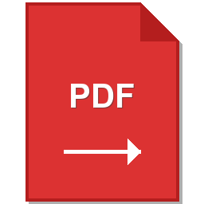

# PDF Data Extractor for Outlook

A Windows desktop application that extracts Purchase Order data from PDF attachments in Microsoft Outlook emails and exports to Excel.



## Features

- 📧 **Outlook Integration**: Directly access emails from your Outlook folders
- 📄 **PDF Extraction**: Automatically parse PO data from PDF attachments
- 📊 **Excel Export**: Generate formatted Excel files with proper data types
- 🔄 **Deduplication**: Automatically handles duplicate entries
- 💾 **Smart Append**: Adds new data to existing Excel files
- ⚙️ **Settings Memory**: Saves your search preferences
- 🎨 **Modern UI**: Clean, professional interface with custom icon

## Installation

### Option 1: Download Pre-built Executable (Easiest)

1. Go to [Releases](../../releases)
2. Download the latest `PDF_Extractor.exe`
3. Run the executable (no installation required)

**Note**: Windows SmartScreen may show a warning since the executable is not code-signed. Click "More info" → "Run anyway" to proceed.

### Option 2: Run from Source

```bash
# Clone the repository
git clone https://github.com/yourusername/pdf-extractor.git
cd pdf-extractor

# Create virtual environment
python -m venv venv
venv\Scripts\activate

# Install dependencies
pip install -r requirements.txt

# Generate icon
python create_icon.py

# Run the application
python src\pdf_extractor_app.py
```

### Option 3: Build Your Own Executable

```bash
# After installing dependencies (see Option 2)
cd src
build_standalone.bat

# Executable will be in: dist\PDF_Extractor.exe
```

## Usage

1. **Launch** the application
2. **Configure filters**:
   - Email address/account
   - Folder name (e.g., "Inbox")
   - Subject keywords
   - Start date (optional)
3. **Choose output** Excel file location
4. **Click** "Extract PDFs from Outlook"
5. **Wait** for processing (progress shown in real-time)
6. **Open** the generated Excel file

## System Requirements

- Windows 10 or Windows 11
- Microsoft Outlook (installed and configured)
- Python 3.11+ (only if running from source)

## Extracted Data Fields

- PDF File name
- Order Number (10-digit)
- Order Date
- Line Number (e.g., 1.1, 2.1)
- Part Number
- Quantity
- Unit Price
- Amount
- Delivery Date
- Ship To Address
- Ordering Office

## Development

### Project Structure

```
pdf-extractor/
├── .github/
│   └── workflows/
│       └── release.yml          # Automated build and release
├── src/
│   ├── pdf_extractor_app.py     # Main application
│   ├── PDF_Extractor.spec       # PyInstaller configuration
│   ├── build_standalone.bat     # Build script
│   └── sign_exe.bat             # Code signing script
├── create_icon.py               # Icon generator
├── icon.ico / icon.png          # Application icon
├── requirements.txt             # Python dependencies
├── .gitignore                   # Git ignore rules
└── README.md                    # This file
```

### Building Releases

The project uses GitHub Actions to automatically build and release executables.

**To create a release**:

```bash
# Create and push a version tag
git tag -a v1.0.0 -m "Release version 1.0.0"
git push origin v1.0.0
```

GitHub Actions will automatically:
- Build the executable
- Calculate SHA256 hash
- Create a GitHub release
- Attach the executable

## Technology Stack

- **GUI**: ttkbootstrap (modern Tkinter themes)
- **PDF Processing**: pdfplumber
- **Excel**: pandas + openpyxl
- **Outlook Integration**: pywin32 (COM interface)
- **Build**: PyInstaller

## Support

For issues, questions, or feature requests:
- Open an [Issue](../../issues)

## License

This project is licensed under the MIT License - see the [LICENSE](LICENSE) file for details.

## Changelog

See [Releases](../../releases) for version history and changes.

---
